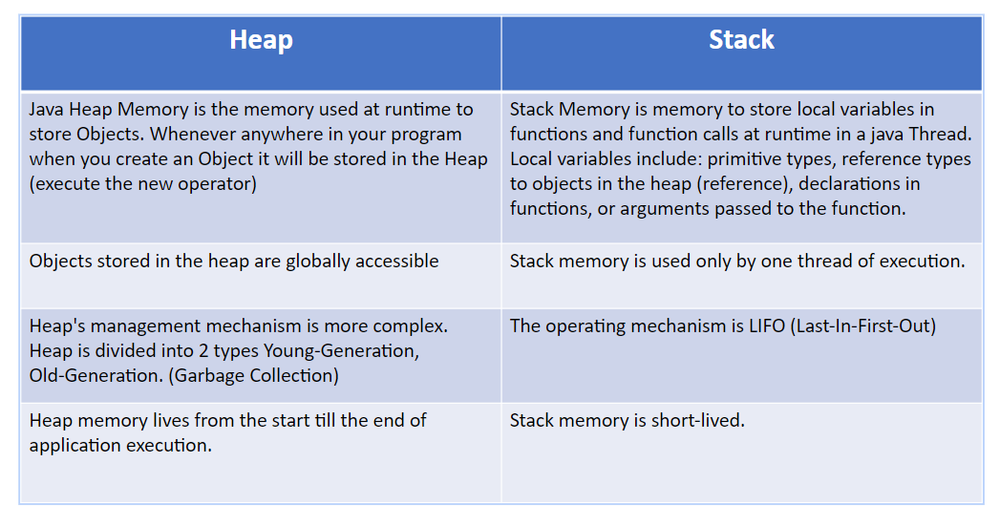

## What is Java?

Java was first introduced by James Gosling, a technology engineer of Sun Microsystems, is a popular high-level programming language widely used for developing a wide range of applications, including web, mobile, desktop, and enterprise applications.

## What is Java programming language used for?

Java is considered as programming langue for develope  android app. It suit for software like Android aStudio and Kotlin.

## Why is Java such a popular choice among modern-day software developers?

Because of the conviniance and compatibility in programming internet, many wellknown platform use Java for their backend system, such as Google, Facebook, Youtube, .... Java is being used for many practice realm like Banking Enterprise, Science Research, Game, Big Data (Hadoop, Apache,... )

## Some knowledge about Java

### Java Fundamental

The essence of Java is a library consists of classes with some program. Classes in Java can be reused in many program, help coder to save many time when develope software and determine bug in program.

### How java programs run

We use IDE to programming code and save as .java file. Java file will be complied to  .class file. JVM is interpreter be installed in different operating system, like window, linus, Mac OS.

**Write once, run every where**

### JDK, JRE and JVM

JDK contains JRE and development kit, overtake a mission provide fully environment and dev tools for programmer to easily development and deploy new proj.
Development tool contain remark following component:
- javac: the compiler take input is source code with Java language into execute file be implemented in JVM.
- java: interpret Javacode to Bytecode. Bytecode is just a intermediate language. JVM through byte will interpret into machine code to run on real Machine.
- Archive: usually be used to compress file class
- jdb: debugger
- javadoc: Dev Tool
- Appleviewer: Interpreter, execute applet . Rmic, rmicregistry.

JRE encompass files are used by JVM to execute and necessary libraries like: java.lang, java.util.

### JVM Architecture

Function of Three main blocks:

1. Class Loader: The Class Loader is responsible for loading Java class files into the JVM. It locates the required class files from the file system, network, or other sources, and then dynamically loads them into the JVM.
2. Runtime Data Area: The Runtime Data Area in Java refers to the memory areas used by the Java Virtual Machine (JVM) to execute Java programs. These areas store various data structures and buffers required for the execution of Java code.
3. Execution Engine: The Execution Engine is responsible for executing the bytecode instructions. It interprets the bytecode or may use Just-In-Time (JIT) compilation techniques to dynamically compile frequently executed bytecode into native machine code for improved performance.

JVM arichecture

[https://www.geeksforgeeks.org/jvm-works-jvm-architecture/]()

### Class loader

+ Bootstrap Class Loader - root class loader. It is the superclass of Extension Class Loader and loads the standard Java packages like java.lang, java.net, java.util, java.io, and so on.
+ Extension Class Loader - subclass of the Bootstrap Class Loader and the superclass of the Application Class Loader. This loads the extensions of standard Java libraries
+ Application Class Loader - final class loader and the subclass of Extension Class Loader. It loads the files present on the classpath. By default, the classpath is set to the current directory of the application.
  The JVM uses the ClassLoader.loadClass() method for loading the class into memory. It tries to load the class based on a fully qualified name.

### Runtime Data Area

### Java Native Interface

JNI acts as a bridge for permitting the supporting packages for other programming languages such as C, C++, and so on. This is especially helpful in cases where you need to write code that is not entirely supported by Java, like some platform specific features that can only be written in C.

### Native Method Libraries

Native Method Libraries are libraries that are written in other programming languages, such as C, C++, and assembly. These libraries are usually present in the form of .dll or .so files. These native libraries can be loaded through JNI.

### Heap Space vs Stack - Memory Allocation in Java

### Garbage Collection

Garbage Collection is process of cleaning and release memory not being used in JVM. Java use GC to manages Heap, which store object in running program.

GC will be process when system decide that a object not be reference by any other object and can be collect

Java does not process GC in some following circumstance:

+ Objects still be referenced and can be accessed from global variables or local variables at scope with lifelong more than object in heap
+ Object still be referenced from running thread or from a blocked thread
+ Object still be referenced from callback method or listener register by some component such as evetn, timer, or system.

## Additional Knowledge

Java and JVM which one is platform-independent?

Java is a programming language which is designed to be independence-platform. This means that we can write Java code once and run it in any platform that has a compatible JVM installed, such that windows, ubuntu, macos, or even embedded system. Java achieves platform independence through its WORA, Write Once, Run Anywhere principle.

Whereas, JVM is reponsible for interpreting and executing Java bytecode. It provides  an abstraction layer between the Java code and the underlying operating system / and hardware. The JVM implementation is platform-specific, meaning that there are diffenrent JVM implementations for different platform. However, Java bytecode generated by Java compiler is the same regardless of the platform.

So, in summary, Java as a language is platform-independent because it can be run on any platform with a compatible JVM. The JVM provides the platform-specific runtime environment necessary to execute Java code on different operating systems and hardware.
