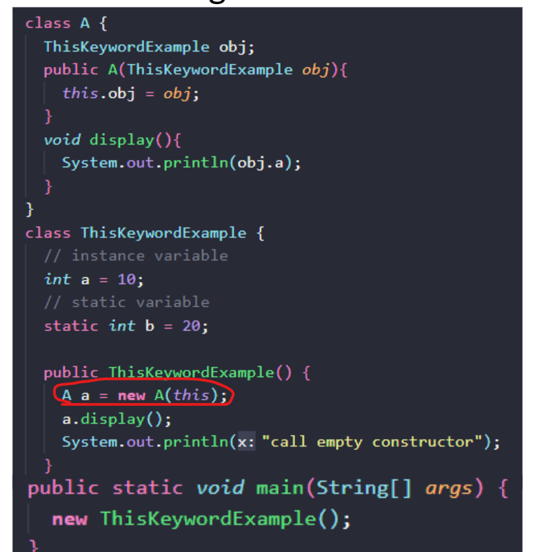

## Wrapper Class

Wrapper Class in Java provide a mechanism from primitive type to object and vice versa

Why we need: Because Java is object-oriented programming language, so we need to deal with some type is set object, like Collection, Serialization, Synchronization

Example of Collection

```java
import java.util.ArrayList;
import java.util.List;

public class Book {
    private String title;
    private String author;
    private int publicationYear;

    public Book(String title, String author, int publicationYear) {
        this.title = title;
        this.author = author;
        this.publicationYear = publicationYear;
    }

    public String getTitle() {
        return title;
    }

    public String getAuthor() {
        return author;
    }

    public int getPublicationYear() {
        return publicationYear;
    }

    public static void main(String[] args) {
        List<Book> bookCollection = new ArrayList<>();

        // Creating book instances
        Book book1 = new Book("To Kill a Mockingbird", "Harper Lee", 1960);
        Book book2 = new Book("1984", "George Orwell", 1949);
        Book book3 = new Book("Pride and Prejudice", "Jane Austen", 1813);
        Book book4 = new Book("The Great Gatsby", "F. Scott Fitzgerald", 1925);

        // Adding books to the collection
        bookCollection.add(book1);
        bookCollection.add(book2);
        bookCollection.add(book3);
        bookCollection.add(book4);

        // Accessing book information
        for (Book book : bookCollection) {
            System.out.println("Title: " + book.getTitle());
            System.out.println("Author: " + book.getAuthor());
            System.out.println("Publication Year: " + book.getPublicationYear());
            System.out.println();
        }
    }
}
```

Example of Serialization

```Java
import java.io.*;

public class SerializationExample {
    public static void main(String[] args) {
        // Creating an object to be serialized
        Employee employee = new Employee("John Doe", "Engineering", 5000);

        // Serialization
        try {
            FileOutputStream fileOutputStream = new FileOutputStream("employee.ser");
            ObjectOutputStream objectOutputStream = new ObjectOutputStream(fileOutputStream);
            objectOutputStream.writeObject(employee);
            objectOutputStream.close();
            fileOutputStream.close();
            System.out.println("Employee object has been serialized.");
        } catch (IOException e) {
            e.printStackTrace();
        }

        // Deserialization
        Employee deserializedEmployee = null;
        try {
            FileInputStream fileInputStream = new FileInputStream("employee.ser");
            ObjectInputStream objectInputStream = new ObjectInputStream(fileInputStream);
            deserializedEmployee = (Employee) objectInputStream.readObject();
            objectInputStream.close();
            fileInputStream.close();
            System.out.println("Employee object has been deserialized.");
        } catch (IOException | ClassNotFoundException e) {
            e.printStackTrace();
        }

        // Accessing deserialized object
        if (deserializedEmployee != null) {
            System.out.println("Name: " + deserializedEmployee.getName());
            System.out.println("Department: " + deserializedEmployee.getDepartment());
            System.out.println("Salary: " + deserializedEmployee.getSalary());
        }
    }
}

class Employee implements Serializable {
    private String name;
    private String department;
    private int salary;

    public Employee(String name, String department, int salary) {
        this.name = name;
        this.department = department;
        this.salary = salary;
    }

    public String getName() {
        return name;
    }

    public String getDepartment() {
        return department;
    }

    public int getSalary() {
        return salary;
    }
}
```

When do we use wrapper class:

+ In general, we should use primitive types unless some special reason ( use Collection, store variable will default value is null)
+ Cost of objects more than correspone primitive data types.
+ Autoboxing Of wrapper does noy reduce object creation, but reduce elaboration of code

## InstanceOf operator

+ Use to check whether an object is an instance of paticular datatype
+ Return type: Boolean
+ Use cases:

  + Wrapper class check

  ```java
  Integer number = 5;
  if (number instanceof Integer) {
      System.out.println("number is an instance of Integer");
  }
  ```

  + An object with the type of subclass also has the type of the superclass

  ```java
  class Vehicle {
      // Vehicle class implementation
  }

  class Car extends Vehicle {
      // Car class implementation
  }

  Car car = new Car();
  if (car instanceof Vehicle) {
      System.out.println("car is an instance of Vehicle");
  }
  ```

  + instance with null variable (?????)

  ```java
  String str = null;
  if (str instanceof String) {
      System.out.println("str is an instance of String");
  } else {
      System.out.println("str is not an instance of String");
  }
  ```

  + Downcasting with instance of (????)

  ```java
  class Animal {
  // Animal class implementation
  }

  class Dog extends Animal {
      // Dog class implementation
  }

  Animal animal = new Dog();
  if (animal instanceof Dog) {
      Dog dog = (Dog) animal;
      System.out.println("Downcasting is successful");
  }
  ```

## Array

+ All the actual values of array are stored in Heap memory
+ 2 steps to create an array: declare and allocate memory to array
+ Multi dimensional array:
  + int [][] arr = new int[3][3];

## This keyword

Function of This keyword:

+ Refer current class instance variables (Coded)
+ Invoke current class method:

  + In Java, when invoking a constructor from another constructor within the same class, the constructor call (using the `this` keyword) must be the first statement in the constructor body.
  + This is because the purpose of invoking a constructor is to initialize the object being constructed before any other operations take place.
+ Invoke current class constructor (Coded)
+ Pass as an argument in the method call

  
+ Pass as an argument in the constructor call
+ Return the current class instance

## Super keyword

Reference variable which is used to refer immediate parent class object

Whenever create the instance of subclass,

## Passing mechanism in Java
