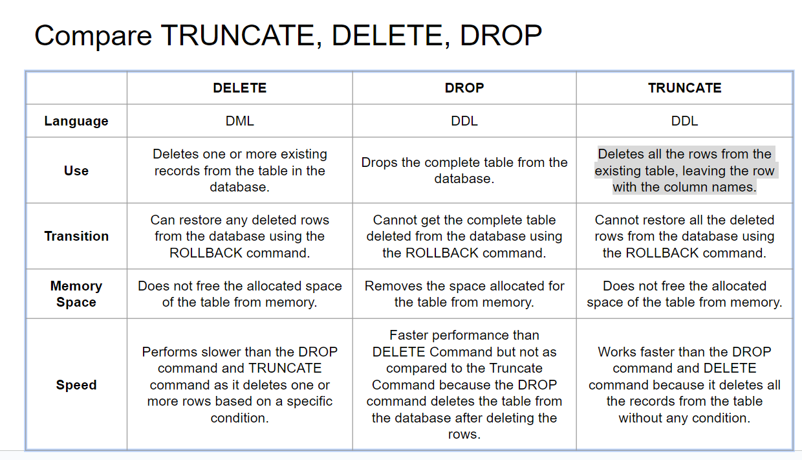
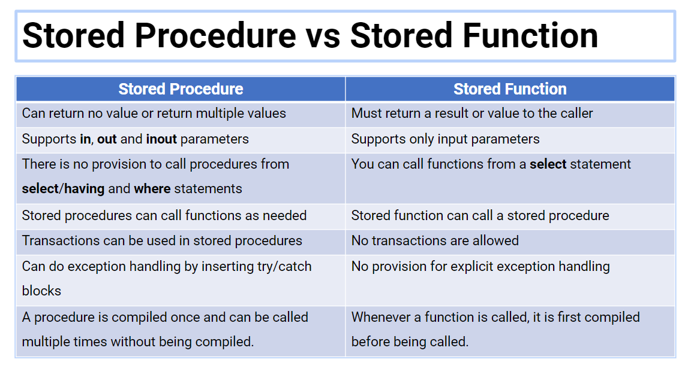
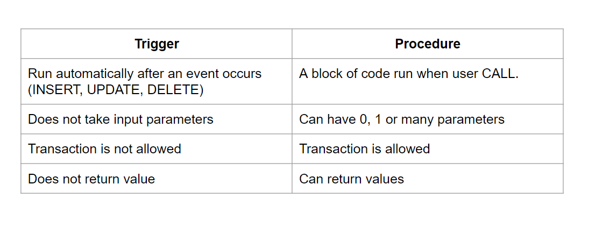

## Compare difference between SQL vs noSQL
SQL:
  + Use structured data model
  + Organized data into table with predefined scheme
  + Each element is stored in SQL as one row, data correspond to each column. 
  + Relation ships between tables are established using keys and foreign key.
  + Usually be used for complex relationships and structured data ( transactional systems, relational reporting, and business intelligence)
noSQL:
  + variety of data models (key-value,value pairs, document stores, graph databases)
  + provide more flexible schemas, allowing for dynamic and unstructured data
  + handling large-scale, rapidly changing, and unstructured data (real-time analytics, content management systems, social networks, and IoT data..).

## Compare SQL and mySQL
SQL stands for Structured Query Language and is a standard language used for managing and manipulating data in relational databases
MySQL, is a specific relational database management system (RDBMS) that uses SQL as its language.

## MySQL Architecture
Include of three mainly layers:
+ Client layer: applications or programs that communicate with the MySQL server to perform various operations on the database.
  + Connection Handling
  + Authentication
  + Security
+ Server layer : 
  + Thread Handling: Take control all the thread was established to Thread Handling module.
  + Parser: (Convert the structure and syntax of the SQL statements and transform them into a format that the server can process.)
      + broken into number of tokens
      + built a data structure(parse tree) of given input
  + Optimizer: applied various types of optimization techniques.
      +  rewriting the query, order of scanning of tables
      +  choosing the right indexes to use etc
  + Output parsing + optimizing stages: query execution plan. This is used by MySQL query execution engine to process the query.
+ Storage layer: Responsible for storing and retrieving all data stored in MySQL, default is InnoDB.
  + balances, reliability, performance designed for processing  many short-lived transactions.

## What is RDBMS
A relational database management system (RDBMS) is 
+ a collection of programs and capabilities that enable IT teams and others to create, update, administer and otherwise interact with a relational database.
## Relational database is a
+ type of database
stores and provides access to data points that are related to one another. 
+ Relational databases are based on the relational model, an intuitive, straightforward way of representing data in tables. In a relational database, each row in the table is a record with a unique ID called the key. The columns of the table hold attributes of the data, and each record usually has a value for each attribute, making it easy to establish the relationships among data points.

## Four crucial properties define relational database transactions

+ **Atomicity** defines all the elements that make up a complete database transaction.
+ **Consistency** defines the rules for maintaining data points in a correct state after a transaction.
+ **Isolation** keeps the effect of a transaction invisible to others until it is committed, to avoid confusion.
+ **Durability** ensures that data changes become permanent once the transaction is committed.

## Different SQL between MySQL
+ SQL stands for Structured Query Language and is a standard language used for managing and manipulating data in relational databases
+ MySQL, is a specific relational database management system (RDBMS) that uses SQL as its language.

## MySQL query route
https://www.youtube.com/watch?v=aKOaQfpW7to

+ services of client layer are:
    + When client request to server -> server accept, client is connected -> client get his own thread for its connection -> with this thread all the queries from client side is excecuted
    + Authentication: is performed on server side, check username and passsword.
    + Security: After authentication, server check privileges of user when issue some certain queries.

+ Route of Simple query:
  + After connection is handled, parser breaks query into tokens and build parse tree
  + Parser: uses SQL language to interpret and validate the queries
  + preprocess check priviliges.
  + Rewriter:  will write again the query if necessary based on some rules stored in MySQL.
  + MySQL uses an optimizer that is based on calculating the cost of each path 
    + -> try to predict the cost of various execution plans and choose the least expensive, 
    + the number actually estimates based on statistics. For example: number of pages per table or index, the number of distinct values of the indexes (cardinality),
  + Output of (parsing+ optimizing): query execution plan.
  + **query execution engine** use plan to process the query
  + Many operations in the plan invoke methods implemented by the storage interface
  + Return a result set to the clients even the queries that don’t return

+ InnoDB balances, higher reliability, high performance, designed for processing  many short-lived transactions
Note: storage engine does affect how server optimize the query

## Entity Relationship
+ is a data modeling technique 
+ used to represent the relationships between entities in a database system. 
+ It provides a graphical representation of the entities, their attributes, and the relationships between them. 
+ The ER model helps in designing a database schema and provides a clear understanding of the data structure
+ An entity–relationship model (or ER model) describes interrelated things of interest in a specific domain of knowledge.
+ A basic ER model is composed of entity types (which classify the things of interest) and specifies relationships that can exist between entities (instances of those entity types).
+ 4 type of relationship:
  + mandatory/optional one/many

## Convention when convert from ER to Relational Database
+ **Entities and Simple Attributes**: Entities ->  is turned into a table
+ **Multi-Valued Attributes**: Each attribute turns into a column (attribute) in the table
+ The key attribute of the entity is the primary key of the table which is usually underlined (can be composite, but can never be null)
  + avoid the use of special characters.
  + If you have a multi-valued attribute, take the attribute and turn it into a new entity or table of its own
+ **1:1 Relationships**: For instance, let us consider the case where the Person has or optionally has one wife, You can place the primary key of the wife within the table of the Persons.  vice versa to put the personid as a foreign key within the Wife table.
+ **1:N Relationships**: To represent such relationship the personid as the Parent node must be placed within the Child table as a foreign key but not the other way around
+ **N:N Relationships**: Use a separate table as shown below:

+ ## Numeric data type
Numeric data type
  + Integer: TINYINT(M), SMALLINT(M),MEDIUMINT(M),INT(M),BIGINT(M)
    + Boolean, bool = inyint(1)
    + Float
      + DECIMAL(M, D):
        + D is the number of digits following the decimal point.
        + Store exact numeric data values.
        + Used when it is important to preserve exact precision, for example with monetary data.
        + Decimal type can avoid rounding
        + exact representation
      + Float(M,d), double(m,d)
        + relatively approximate representation
        + is suitable for scientific and technical computations
+ Date and Time data type ( DATE , Time, datetime, timestamp, year)
+ String data type: ( char and varchar, binary and var binary)

Other Datatype:
+ BLOB: binary large object that can hold a variable amount of data
+ An ENUM is a string object with a value chosen from a list of permitted values that are enumerated explicitly in the column specification at table creation time.
  + Can have zero or more value

## SQL Commands? (DDL, DML, TCL, DQL, DCL)
+ DDL: is a set of SQL commands used to change data structure like create, modify, and delete database structures but not data
+ DQL: 
  + Used to get data from the db, and set order on them.
  + Include SELECT query to get the data from the database.
  + Return results from SELECT is stored in a table.

## SQL Commands
+ DDL: (Data Definition Language) change the table structures
  + Modify structures but not data
  + Create, drop, alter, truncate
+ DQL: (Data Query Language)
  + Used to get data from the db, and set order on them
  + Include SELECT query to get the data from the database, return result is stored in a table
  + SELECT
+ DML: (Data Manipulation Language)
  + Used to add, delete, or modify records in a table
  + (  INSERT ,UPDATE ,DELETE ,LOCK ,CALL ,EXPLAIN PLAN)
+ DCL:  Data Control Language
  + DCL commands handle database system permissions and other controls.
  + GRANT and REVOKE
+ Transaction Control Language
  + Commit
  + Rollback
  + savepoint
  + set transaction

Có nhiều hơn một khóa primary key trong database không? 

## Truncate, delete and drop 
+ DML: Deletes one or more existing records from the table in the database.
+ Drops the complete table from the database.

## Constraint
+ used to specify rules for the data in a table
+ used to limit the type of data that can go into a table. 
+ ensures the accuracy and reliability of the data in the table
+ Constraints can be column level or table level
 7 constraint (  NOT NULL , UNIQUE , PRIMARY KEY ,FOREIGN KEY , CHECK ,DEFAULT ,CREATE INDEX)

## Primary
+ Primary key: A combination of a NOT NULL and UNIQUE. Uniquely identifies each row in a table
+ Foreign key: Prevents actions that would destroy links between tables
## Truncate, Delete and drop

## View
+ Store SELECT statement
+ view >< table is view is not considered a real table existed in db
+ Advantage:
  + Simply complex query
  + Make the business logic consitence across different applications or systems
  + Add extra security layer
  + Enable backward compatibility:  presents the modified data structure while maintaining backward compatibility with the existing application.

## Index
  + uses indexes to quickly find rows with specific column values. Without an index, MySQL must scan the whole table to locate the relevant rows. The larger table, the slower it searches.
  + is a data structure such as B-Tree that improves the speed of data retrieval on a table at the cost of additional writes and storage to maintain it.
  + when create a table with a primary key or unique key, MySQL automatically creates a special index named PRIMARY. This index is called the clustered index.
  + The PRIMARY index is special because the index itself is stored together with the data in the same table. The clustered index enforces the order of rows in the table.
  + Other indexes other than the PRIMARY index are called secondary indexes or non-clustered indexes.
## Join 

+ A relational database consists of multiple related tables linking together using foreign key columns. 
+ Information from each table is incomplete from the business perspective
+ To get complete order’s information, you need to query data from both tables. That’s why joins come into the play.

## Join function
+ Inner join clause
  + joins two tables based on a condition which is known as a join predicate
  + Inner join clause includes only matching rows from both tables
  + If two column in two table have the column name, we can alternatively use USING keyword.

+ Left join:
  + Selects all data from the left table whether there are matching rows exist in the right table or not
  + In case there are no matching rows from the right table found, the left join uses NULLs for columns of the row from the right table in the result set.

+ Full join:
  + Take all side of join even if we have **matching on the other side or not**.
  + UNION ALL explicitly, the duplicate rows, if available, remain in the result
  + UNION stacks the results of two query together.

+ Self join:
  + The self join is often used to query hierarchical data or to compare a row with other rows within the same table
  + To perform a self join, you must use table aliases to not repeat the same table name twice in a single query.

+ Cross join:
+ The cross join makes a Cartesian product of rows from the joined tables.
+ The cross join combines each row from the first table with every row from the right table to make the result set.
+ Cross join from n rows table with m rows table will result m*n table.
+ The cross join is useful for generating planning data. For example, you can carry the sales planning by using the cross join of customers, products, and years.

## Subqueries
+ query nested within another query
+ When executing the query, MySQL evaluates the subquery first and uses the result of the subquery for the outer query
+ Subqueries has two type:
  + Non-Correlated Subqueries: executed independently of the outer query and returns a single value or result set that is used by the outer query
  + Correlated Subqueries: refers to one or more columns in the outer query and is executed once for each row returned by the outer query

## Join vs subqueries performance
+ A subquery is easier to write, but a join might be better optimized by the server. 
+ For example a Left Outer join typically works faster because servers optimize it
+ Also, on some occasions, it is not only possible to rewrite a query without a subquery, but it can be more efficient to make use of some of these techniques rather than to use subqueries. One of these is the IN() construct
## Stored Procedured 

## Trigger
+ stored procedure in db, which automatically invokes whenever a special event in the db occurs.
+ It is a stored procedure without parameters and return value
+ The SQL standard defines two types of triggers: row-level triggers and statement-level triggers.
  + A row-level trigger is activated for each row that is inserted, updated, or deleted.
  + A statement-level trigger is executed once for each transaction regardless of how many rows are inserted, updated, or deleted.
+ When we use trigger:
  + Check constraints
  + Ensure data intergrity

## Trigger vs Procedure

## Transaction
+ It is a group of work that is performed sequentially against the database
  + Change will be successful when transaction commit.
  + Change won’t be successful when transaction rollback.
+ A transaction start with SQL statement, and it is end when it found COMMIT or ROLLBACK.

