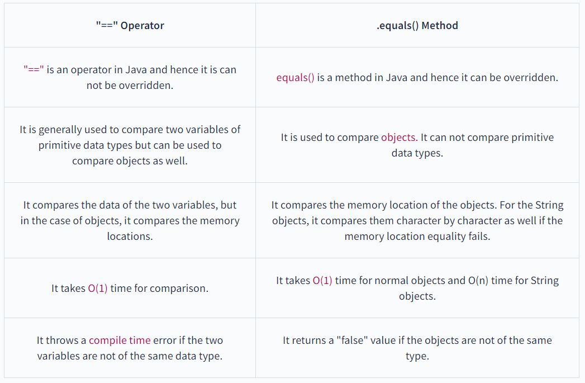

## Meeting note 22/5/2023

Issue 1:

- Install JDK 11
- Why should we use JDK 11 rather than newer version?
    - Stability and Long-Term Support:
        - These older version is a LTS release, means that it receives update and bug extended period  for a long period.
        - JDK have stability and have more mature and proven JDK version
        - When deploy some application, require the availability and compatibility of third party libraries, framework and tools that project relies one. With lower JDK version will ensure that they are compatible with the JDK version that we choose.
        - JDK 11 have stronger community support and documentation available.
    - Ecosystem and Community Support

**Meeting note 24/5/2023**

### AutoBoxing and  Unboxing:

### 2 Type of  AutoBoxing and Unboxing:

+ Implicit:

```java
  int val = 1;
  Integer wrapVal = new Interger();
  wrapVal = new wrapVal
```

+) Explicit

### Reasons why we use `this` in the first line of a constructor:

+ The parent class' constructor needs to be called before the subclass' constructor. This will ensure that if you call any methods on the parent class in your constructor, the parent class has already been set up correctly.
+ Consider this case, we have a super class ‘Human’. Let one of its sub class be ‘Man’. So for a ‘Man’ to get created, it must first be a ‘Human’ (maintain the hierarchy) .
## Meeting note 25/5

+ Naming Conventions:
    + Class Names:
        + Start with an uppercase letter.
        + Use nouns or noun phrases that describe the class's purpose.
        + Avoid using underscores; instead, use camel case (e.g., `MyClass`).
    + Constant Names:
        + Use uppercase letters for the entire name
        + Separate words with under scores: Max Values
    + Method Name:
        + Start with lowercase letter
        + Use verb or verb phrase decribe the method's action
        + Use camel case instead of using under score
    + Pakage Name: Use lowercase letter
        + Use a reversed domain name to ensure uniqueness
    + Acronyms and Abbreviations:
        + Acronyms should be treated as words (e.g., `XMLParser`).
        + Abbreviations should be avoided or used sparingly.
+ Upcasting, downcasting
    + Assign subclass variable for supperclass reference variable
    + Downcasting: assign object of supperclass for subclass reference variable
      + Usecase: want to access specific methods or properties unique to each derived class 
+ Static Method - Static void Main
## Why are interface variables static and final by default?
Interface variables are static because Java interfaces cannot be instantiated in their own right; the value of the variable must be assigned in a static context in which no instance exists. The final modifier ensures the value assigned to the interface variable is a true constant that cannot be re-assigned by program code.

Purpose of interface: provide common variable that can be accessed from any Classing using that interface.

Static Final == Constant

Variable Final: Initialize Once
Method Final: Subclass cannot override
Class Final: Can have subclass
Static final: declared but dont initialize

## Static biding, static binding
When type of the object is determined at compiled time(by the compiler), it is known as static binding.
When type of the object is determined at run-time, it is known as dynamic binding.

## Equals, hashCode, ==
The equals() method of the Object class compare the equality of two objects. The two objects will be equal if they share the same memory address.
In Java, the == operator compares that two references are identical or not. Whereas the equals() method compares two objects.



## When is single thread have better performance than single thread?
+ When the task is not parallelizable/ algorithm is not suitable for parallelization: Some tasks are inherently sequential and cannot be divided into smaller independent parts that can be executed concurrently.
+ When the overhead of thread synchronization is significant( locks or semaphores, to ensure thread safety and coordinate access to shared resources).
[//]: # (a semaphore is a synchronization mechanism commonly used in concurrent programming to control access to shared resources and coordinate the execution of multiple threads or processes.)
+ When the resources are limited (lack of CPU, memory, fast I/O system)
+ When the problem size is small: For small problem sizes, the overhead of thread creation, management, and synchronization can outweigh the benefits of parallel execution


## String buffer and string builder
+ String Builder không an toàn cho đa luồng, Nó không hỗ trợ cơ chế threadsafe, -> Không đảm bảo tính toàn vẹn giữ liệu.

## String Comparison
+ .equalsIgnoreCase()
+ != Comparison
+ contentEquals with character array
+ contentEquals with StringBuffer.

# Meeting note 31/5
+ relationship between equal and hashcode
+ loosely couple
+ Java reflection

//remark: Small project not usually use Generics type.
May contain duplicate elements.
Maintains the order of elements added.
Asynchronous (non-synchronized).

Utilities Class - Helper Class
+) Class that have Utilities Method
+) For collection interface
+) 

**Map is not inherit in java collection, but provide collection-view operation for user to program easier**


HashSet - HashCode

## Meeting note 6/5/2023

Java Reflection.
HashMap? Default Capacity of constructor -> Multiple constructor. 
loadFactor

Cây đỏ đen
+)  Self balance tree 
+)
    -> 
+)  

+) Key-value
    Tại sao cần dummy value ->
    Mọi hoạt động của map chủ yếu dựa vào Key, giá trị value không quan trọng


ArrayList:
+) Index Data Structure
+) update the 
+) Basically

Exception looping Manipulate:
+) example : for each -> đẩy ra Exception

Khắc phục: sử dụng iterator.

remove:(ko dùng phương thức của collection)

Throw/ throws 
explitcity handle exception

throw check-> phải xử lý ngay tại thời điểm compile time

throws -> có ther throw cả checked và unchecked exception


Custom exception
-> runtime exception

Exception handling with overriding

Các thành phần làm việc với nhau dưới dạng byte
-> Cần 1 cơ chế chung đảm bảo việc truyền và nhận dữ liệu từ 2 phía

Class cha implement thì class con không cần.

static + transient  

Mục đích : để nhận biết nhau (trước khi serialize và sau khi deserialize).


final transient có được ghi hay không 

## Java Predefined-Functional Interfaces

## Meeting note 6/6
Hidden method
**implement: final transient**
+ Method 
+ Eager call method 
+ Compare Stream and asd
+ ifPresent
+ isPresent
+ flatmap()

## 